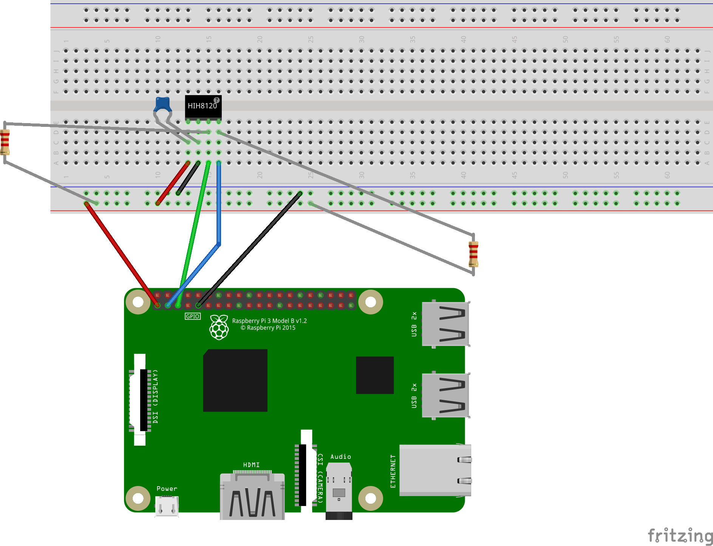

# HIH8120 Honeywell Humidity and Temperature Sensor
## BOM
QTY 1 - HIH8120-021 SIP (Digikey) [Cut Tape](https://www.digikey.com/product-detail/en/honeywell-sensing-and-productivity-solutions/HIH8120-021-001/480-5706-1-ND/4291621)

QTY 1 - 4 Pin Pitch Adapter Conversion PCB (Proto Advantage) [1.27mm to 2.54 mm conversion](https://www.proto-advantage.com/store/product_info.php?products_id=3800050)

QTY 1 - 0.22mF Ceramic Capacitor

QTY 2 - 2.2 kOhm Resistors

QTY 1 - Raspberry Pi 3 Model B (Windows IoT Core OS)

QTY 1 - Breadboard

Jumper Wires

## Breadboard Breakdown

### Wiring Summary
1. Raspberry PI 3.3V Power to BB Power Rail
1. Raspberry PI GND to BB Ground Rail
1. HIH8120 PIN 1 to BB Power Rail
1. HIH8120 PIN 2 to BB Ground Rail
1. CAP Between HIH8120 PIN 1 And HIH8120 PIN 2
1. RESISTOR Between HIH8120 PIN 3 And BB Power Rail
1. RESISTOR Between HIH8120 PIN 4 And BB Power Rail
1. HIH8120 PIN 3 to Raspberry PI SCL (Pin 5)
1. HIH8120 PIN 4 to Raspberry PI SDA (Pin 3)
