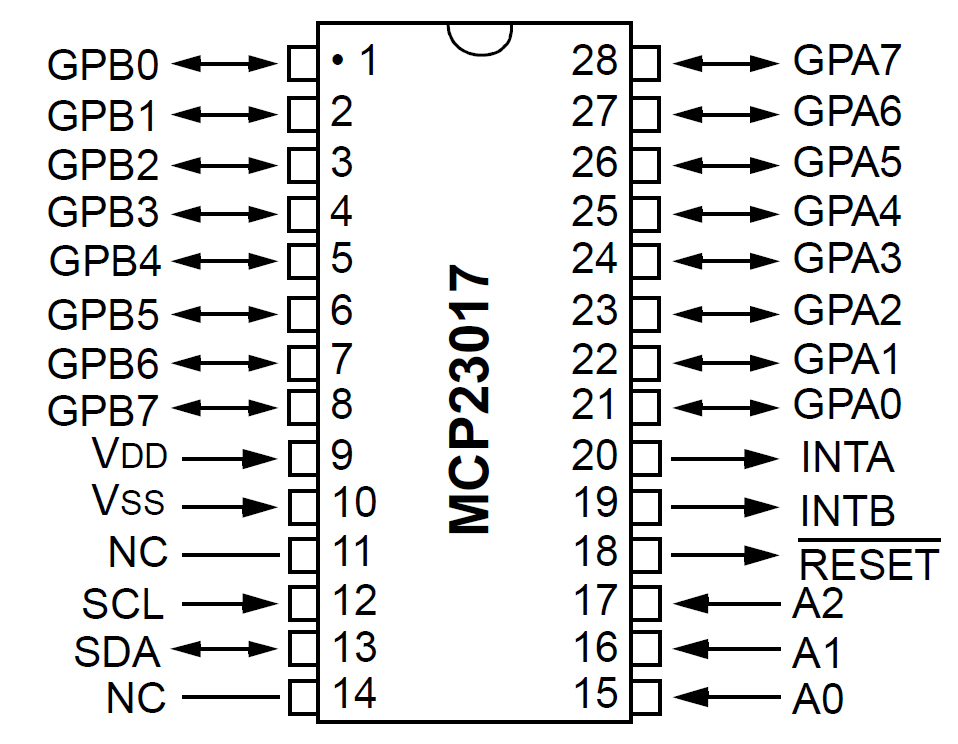
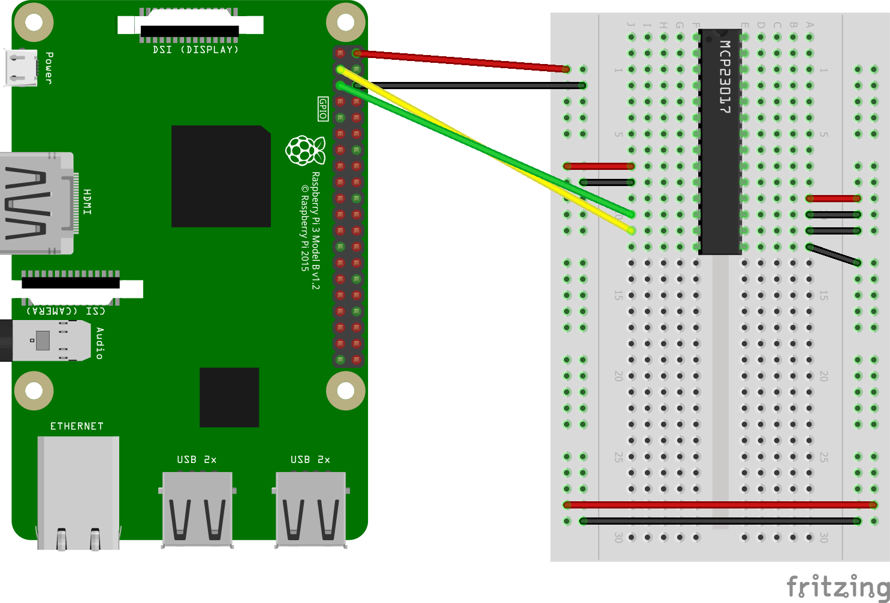

# MCP23017 16-bit I/O Port Expander

While the MCP23017 is an IC and not a sensor, but it is a handy implementation to hang around. This IC allows you to add 16 GPIO pins through I2C. This is not a full implementation, the interrupt functionality isn't written, but is sufficient to do basic GPIO input/output with read and writes.

Use this class to first initialize the IC, then set the pins drive mode to input or output, finally read and write to your heart's content. 

## BOM
QTY 1 - MCP23017 (Digikey) [Tube](https://www.digikey.com/product-detail/en/microchip-technology/MCP23017-E-SP/MCP23017-E-SP-ND/894272)

QTY 1 - Raspberry Pi 3 Model B (Windows IoT Core OS)

QTY 1 - Breadboard

Jumper Wires

## MCP23017 Pinouts

## Breadboard Breakdown

### Wiring Summary
1. Raspberry PI 5V Power to BB Power Rail
2. Raspberry PI GND to BB Ground Rail
3. BB Jump Power rail to Power rail on opposite side
4. BB Jump Ground rail to Ground rail on opposite side
5. MCP23017 pin 17 (A2) to Ground rail
6. MCP23017 pin 16 (A1) to Ground rail
7. MCP23017 pin 15 (A0) to Ground rail
8. MCP23017 pin 18 (RESET) to Power rail
9. MCP23017 pin 9 (VDD) to Power rail
10. MCP23017 pin 10 (VSS) to Ground rail
11. MCP23017 pin 12 (SCL) to Raspberry PI pin 5 (SCL/GPIO3)
12. MCP23017 pin 13 (SDA) to Raspberry PI pin 3 (SDA/GPIO2)

## References
[Adafruit Arduino MCP23017](https://github.com/adafruit/Adafruit-MCP23017-Arduino-Library)
[Adafruit WinIoTCore MCP23017](https://github.com/adafruit/AdafruitClassLibrary/blob/master/AdafruitClassLibrary/MCP23017.cs)
[SmartFaire on Raspberry Pi 2](https://www.hackster.io/windows-iot/smartfaire-on-raspberry-pi-2-bda1dc)
[Microelk](http://microelk.azurewebsites.net/MCP23017/MCP23017)
[Raspberry Pi Components](https://github.com/mphacker/RaspberryPiComponents/blob/master/RaspberryPiComponents/MCP23017.cs)
[Medienstudio](https://medienstudio.net/development-en/mcp23017-esp-with-dragonboard-410c-on-windows-iot-core/?lang=en)
[TNKSoft](https://www.tnksoft.com/blog/?p=4713)